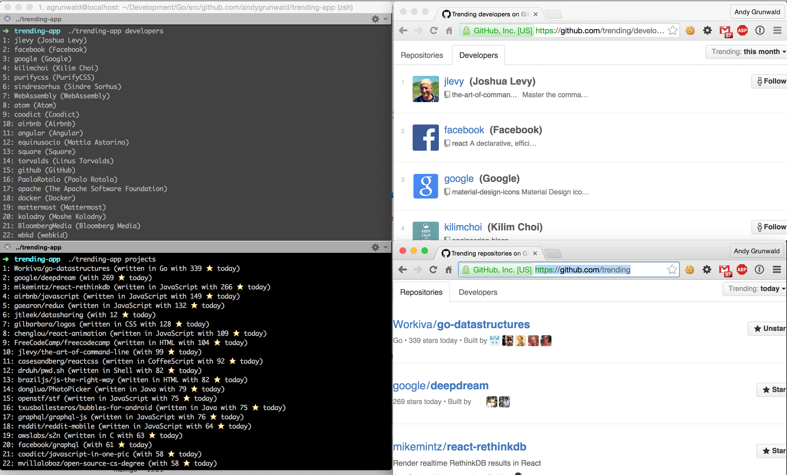

# go-trending

[](https://godoc.org/github.com/andygrunwald/go-trending)
[](https://travis-ci.org/andygrunwald/go-trending)
[](https://goreportcard.com/report/github.com/andygrunwald/go-trending)

A package to retrieve [trending repositories](https://github.com/trending) and [developers](https://github.com/trending/developers) from Github written in [golang](https://golang.org/).

[](https://raw.githubusercontent.com/andygrunwald/go-trending/master/img/go-trending-shrinked.png)

This package were inspired by [rochefort/git-trend](https://github.com/rochefort/git-trend) (Ruby) and [sheharyarn/github-trending](https://github.com/sheharyarn/github-trending) (Ruby).

## Features

* Get trending repositories
* Get trending developers
* Get trending languages
* Get all programming languages known by GitHub
* Filtering by time and (programming) language
* Support for [GitHub Enterprise](https://enterprise.github.com/)

## Installation

It is go gettable

    $ go get github.com/andygrunwald/go-trending

(optional) to run unit / example tests:

    $ cd $GOPATH/src/github.com/andygrunwald/go-trending
    $ go test -v

## API

Please have a look at the [GoDoc documentation](https://godoc.org/github.com/andygrunwald/go-trending) for a detailed API description.

## Examples

Further a few examples how the API can be used.
A few more examples are available in the [GoDoc examples section](https://godoc.org/github.com/andygrunwald/go-trending#pkg-examples).

### List trending repositories of today for all languages

```go
package main

import (
	"fmt"
	"github.com/andygrunwald/go-trending"
	"log"
)

func main() {
	trend := trending.NewTrending()

	// Show projects of today
	projects, err := trend.GetProjects(trending.TimeToday, "")
	if err != nil {
		log.Fatal(err)
	}
	for index, project := range projects {
		no := index + 1
		if len(project.Language) > 0 {
			fmt.Printf("%d: %s (written in %s with %d ★ )\n", no, project.Name, project.Language, project.Stars)
		} else {
			fmt.Printf("%d: %s (with %d ★ )\n", no, project.Name, project.Stars)
		}
	}
}
```

### List trending repositories of this week for golang

```go
package main

import (
	"fmt"
	"github.com/andygrunwald/go-trending"
	"log"
)

func main() {
	trend := trending.NewTrending()

	// Show projects of today
	projects, err := trend.GetProjects(trending.TimeWeek, "go")
	if err != nil {
		log.Fatal(err)
	}
	for index, project := range projects {
		no := index + 1
		if len(project.Language) > 0 {
			fmt.Printf("%d: %s (written in %s with %d ★ )\n", no, project.Name, project.Language, project.Stars)
		} else {
			fmt.Printf("%d: %s (with %d ★ )\n", no, project.Name, project.Stars)
		}
	}
}
```

### List trending developers of this month for Swift

```go
package main

import (
	"fmt"
	"github.com/andygrunwald/go-trending"
	"log"
)

func main() {
	trend := trending.NewTrending()

	developers, err := trend.GetDevelopers(trending.TimeMonth, "swift")
	if err != nil {
		log.Fatal(err)
	}
	for index, developer := range developers {
		no := index + 1
		fmt.Printf("%d: %s (%s)\n", no, developer.DisplayName, developer.FullName)
	}
}
```

### List available languages

```go
package main

import (
	"fmt"
	"github.com/andygrunwald/go-trending"
	"log"
)

func main() {
	trend := trending.NewTrending()

	// Show languages
	languages, err := trend.GetLanguages()
	if err != nil {
		log.Fatal(err)
	}
	for index, language := range languages {
		no := index + 1
		fmt.Printf("%d: %s (%s)\n", no, language.Name, language.URLName)
	}
}

```

## Implementations

* [sikang99/hub-trend](https://github.com/sikang99/hub-trend/)
* [andygrunwald/TrendingGithub](https://github.com/andygrunwald/TrendingGithub) - [@TrendingGithub](https://twitter.com/TrendingGithub)

## License

This project is released under the terms of the [MIT license](http://en.wikipedia.org/wiki/MIT_License).
